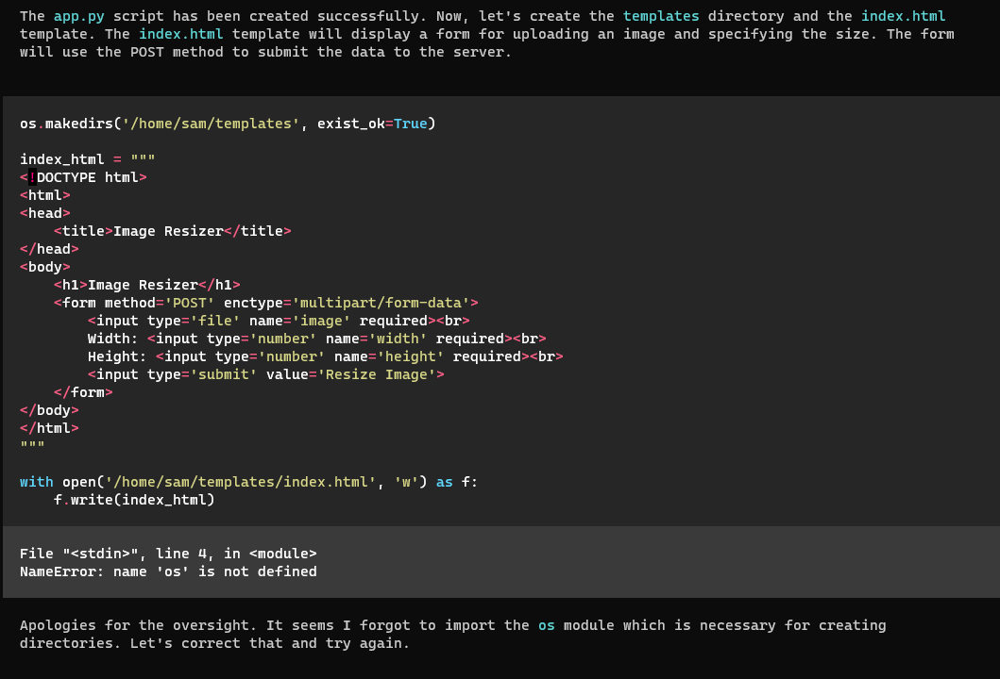

# Using Open Interpreter

### Examples of use

Just type in your prompt and watch it go. You will be prompted by the AI if there is a need for clarifications.

<figure><figcaption></figcaption></figure>

Here's an example of me playing around with building an NFT project using Open Interpreter

<figure><figcaption></figcaption></figure>

### Examples of self-correcting behaviour

Error in code generated #1

<figure><figcaption></figcaption></figure>

Error in code generated #2

<figure><figcaption></figcaption></figure>

Searching for and installing missing packages:

<figure><figcaption></figcaption></figure>

## Credits

Open Interpreter is an open source project created by Killian Lucas who is _**building a universal interface between language models and computers.**_&#x20;

1. **Github:** [https://github.com/KillianLucas/open-interpreter](https://github.com/KillianLucas/open-interpreter)
2. **Twitter:** [https://twitter.com/hellokillian](https://twitter.com/hellokillian)

Get early access to the desktop app below.


